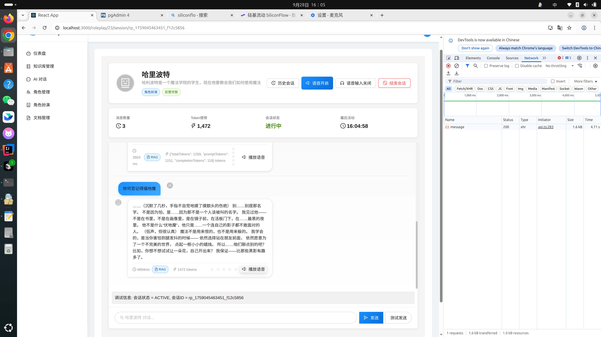

# 🎭 AI角色扮演系统 - 架构设计文档

## 📋 项目概述

本项目旨在构建一个基于RAG（检索增强生成）技术的AI角色扮演对话系统，支持用户创建个性化AI角色并进行语音交互对话。作为个人开发项目，我们专注于打造一个功能完整、架构清晰的基础平台。

## 🎯 设计目标

### 核心目标
- **智能角色创建**：支持用户自定义AI角色的性格、背景和对话风格
- **沉浸式对话体验**：提供自然流畅的语音交互和文本对话
- **知识库驱动**：基于用户上传的文档构建角色专属知识库
- **多模态交互**：集成语音输入输出，提升用户体验

### 技术愿景
构建一个可扩展、高性能的AI对话平台，为角色扮演应用提供坚实的技术基础。

## 🔬 技术调研与选型

### 大模型应用开发路线分析

通过深入调研相关论文和现有产品，我们总结出大模型对话应用的主要技术路线：

| 技术路线 | 优势 | 劣势 | 适用场景 |
|---------|------|------|----------|
| **微调SFT** | 效果最佳，高度定制 | 成本高，需要大量数据 | 大型商业应用 |
| **LoRA微调** | 成本适中，效果良好 | 需要技术积累 | 中等规模应用 |
| **RAG检索** | 成本低，易实现 | 依赖知识库质量 | 知识密集型应用 |
| **Prompt Engineering** | 快速迭代，灵活性高 | 效果有限 | 原型验证 |

### 技术选型决策

考虑到项目资源和开发周期，我们选择了 **RAG知识库检索 + Prompt Engineering** 的技术路线，这种组合能够在有限资源下实现较好的对话效果。

## 🎬 系统演示

### 功能演示视频
<video width="800" controls>
  <source src="imgs/demo-video.webm" type="video/webm">
  您的浏览器不支持视频播放。请<a href="imgs/demo-video.webm">点击这里下载视频</a>观看演示。
</video>

*系统完整功能演示：从知识库创建到角色对话的全流程展示*

## 结果展示

## 整体架构

### 开发路线

我们采用**4步走策略**，确保系统功能的渐进式完善：

#### 🏃‍♂️ Phase 1: 基础RAG系统
- ✅ 实现用户认证与权限管理
- ✅ 构建知识库管理功能
- ✅ 开发文档上传与处理
- ✅ 实现基础RAG对话功能

#### 🎤 Phase 2: 语音交互
- ✅ 集成语音输入识别
- ✅ 实现语音输出合成
- ✅ 优化语音交互体验

#### 👤 Phase 3: 角色系统
- ✅ 设计角色数据模型
- ✅ 实现角色创建与配置
- ✅ 开发角色配置文件生成

#### 💬 Phase 4: 角色对话
- ✅ 构建角色扮演对话引擎
- ✅ 实现上下文感知对话
- ✅ 优化对话质量与连贯性

### AI模型选型

#### 🧠 对话生成模型
**Qwen/Qwen3-Next-80B-A3B-Instruct**
- **选择理由**: 不花钱的东西，还要什么自行车？

#### 🔍 文本向量化模型
**BAAI/bge-large-zh-v1.5**
- **选择理由**: 不花钱的东西，还要什么自行车？
 

#### 🎵 语音处理模型
**FunAudioLLM/SenseVoiceSmall**
- **选择理由**: 不花钱的东西，还要什么自行车？

### 数据库设计

#### 向量数据库选型：PostgreSQL + pgvector
**选择理由**：
- ✅ 无它，唯手熟尔！

