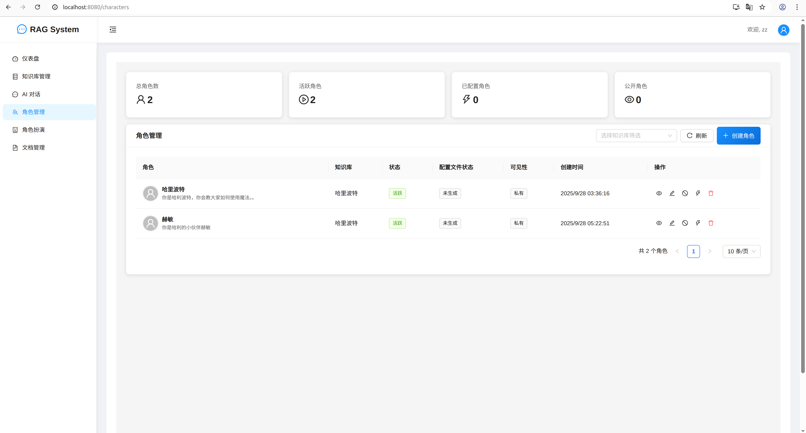
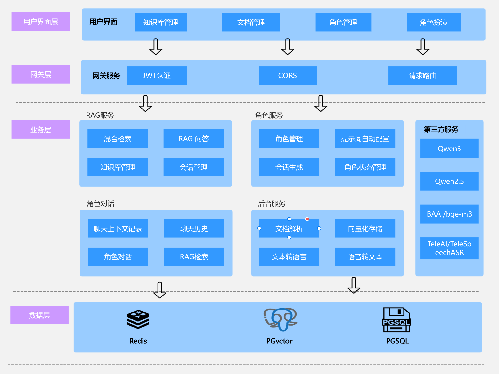

# RAG-one 项目部署指南

## 📋 项目概述

letusCHatchat 是一个基于 Spring Boot + React 的 RAG (Retrieval-Augmented Generation) 系统，支持文档上传、知识库管理和角色扮演功能。

## 🖼️ 项目展示

### 功能演示视频
<video width="800" controls>
  <source src="imgs/demo-video.webm" type="video/webm">
  您的浏览器不支持视频播放。请<a href="imgs/demo-video.webm">点击这里下载视频</a>观看演示。
</video>

### 主界面


### 功能展示


### 系统架构


### 完整部署脚本（功能更全）

```bash
# 给脚本添加执行权限
chmod +x deploy-full.sh

# 执行完整部署
./deploy-full.sh

# 或者带清理选项
./deploy-full.sh --clean

# 查看帮助
./deploy-full.sh --help
```

## 📦 项目结构

```
RAG-one/
├── deploy-quick.sh              # 快速部署脚本
├── deploy-full.sh               # 完整部署脚本
├── Dockerfile.fullstack         # 全栈Dockerfile
├── docker-compose.fullstack.yml # 全栈Docker Compose配置
├── data/
│   └── ragone_schema.sql       # 数据库初始化脚本
├── imgs/                       # 项目展示图片
│   ├── image.png              # 主界面截图
│   ├── image copy.png         # 功能展示截图
│   └── image copy 2.png       # 系统架构图
├── .env                        # 环境变量配置
└── DEPLOYMENT.md              # 本文档
```

## ⚙️ 环境配置

### 必需的环境变量

在 `.env` 文件中配置以下变量：

```bash
# AI 模型配置（必需）
SILICONFLOW_API_KEY=your_api_key_here

# JWT 配置（必需，至少32位）
JWT_SECRET=your_jwt_secret_here

# 数据库配置
DB_PASSWORD=ragone_password
DB_USERNAME=ragone_user
DB_NAME=ragone


### 获取 API 密钥
（现在配置文件中包含我自己的API密钥，可直接运行）
1. 访问 [SiliconFlow](https://siliconflow.cn/) 注册账号
2. 获取 API 密钥
3. 在 `.env` 文件中设置 `SILICONFLOW_API_KEY`

## 🌐 访问地址

部署完成后，可以通过以下地址访问：

- **前端界面**: http://localhost:8080
- **后端API**: http://localhost:8080/api

## 📊 服务端口

| 服务 | 容器端口 | 主机端口 | 说明 |
|------|----------|----------|------|
| 前端+后端 | 80 | 8080 | 主应用 |
| PostgreSQL | 5432 | 5433 | 数据库 |
| Redis | 6379 | 6380 | 缓存 |
